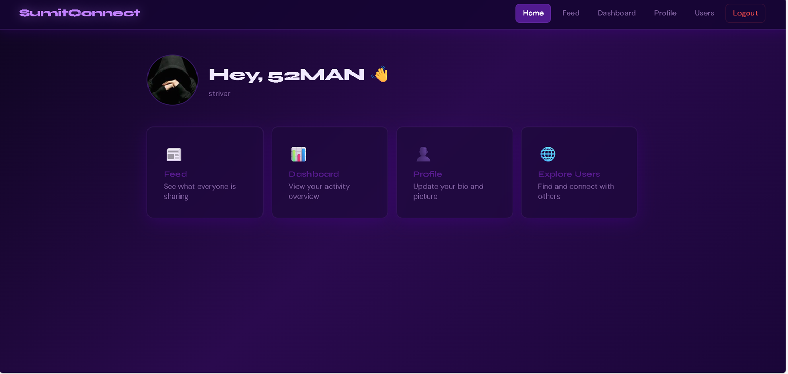
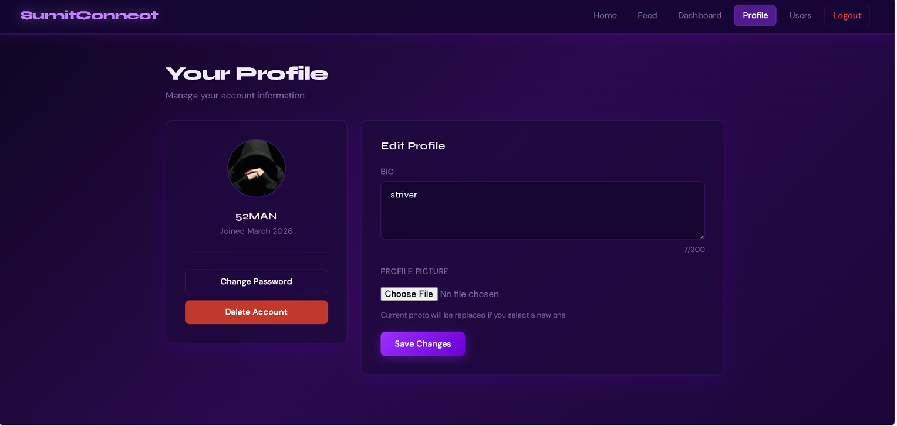
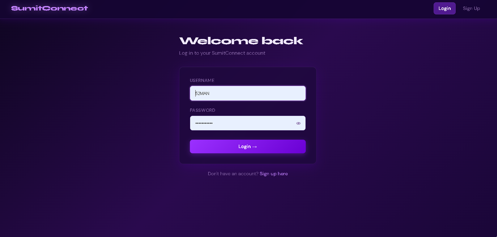

# 🌐 SumitConnect

A full-featured **social media web application** built with **Django** — inspired by Instagram. Users can create profiles, make posts, like and comment on posts, and follow other users.

---

## 🚀 Live Demo

> 🔗 **[https://sumitconnect.onrender.com](https://sumitconnect.onrender.com)**
> ⚠️ _Free tier — first load may take 30-60 seconds to wake up_

---

## ✨ Features

### 👤 User Authentication

- Signup with username and password
- Login and Logout
- Password change
- Account deletion with password confirmation

### 🧑 Profile System

- Upload profile picture
- Write and update bio
- View joined date
- View followers and following count

### 📝 Post / Feed System

- Create posts with text and optional image
- View all posts in a feed (newest first)
- Delete your own posts

### ❤️ Like System

- Like and unlike any post
- Live like count on each post

### 💬 Comment System

- Comment on any post
- Delete your own comments
- Comment count displayed on feed

### 👥 Follow / Unfollow System

- Follow and unfollow other users
- Followers and following count on every profile

### 🔍 Search

- Search users by username
- Case insensitive search

### 🔐 Admin Panel

- Full Django admin panel for superuser
- Manage users, posts, comments from admin

---

## 🛠️ Tech Stack

| Technology     | Usage                           |
| -------------- | ------------------------------- |
| Python 3.13    | Backend language                |
| Django 6.0     | Web framework                   |
| SQLite         | Database                        |
| HTML5 / CSS3   | Frontend                        |
| Google Fonts   | Typography (Syne + DM Sans)     |
| Django Auth    | Authentication system           |
| Django Signals | Auto profile creation on signup |

---

## 📁 Project Structure

```
SumitConnect/
└── myproject/
    ├── accounts/
    │   ├── templates/
    │   │   └── accounts/
    │   │       ├── base.html
    │   │       ├── home.html
    │   │       ├── dashboard.html
    │   │       ├── feed.html
    │   │       ├── post_detail.html
    │   │       ├── profile.html
    │   │       ├── user_profile.html
    │   │       ├── users.html
    │   │       ├── login.html
    │   │       ├── signup.html
    │   │       ├── change_password.html
    │   │       └── delete_account.html
    │   ├── models.py
    │   ├── views.py
    │   ├── urls.py
    │   ├── admin.py
    │   └── apps.py
    ├── myproject/
    │   ├── settings.py
    │   ├── urls.py
    │   └── wsgi.py
    ├── media/
    ├── .gitignore
    └── manage.py
```

---

## ⚙️ How to Run Locally

### Step 1 — Clone the repository

```bash
git clone https://github.com/sumitkumar98313/SumitConnect.git
cd SumitConnect/myproject
```

### Step 2 — Install dependencies

```bash
pip install django pillow
```

### Step 3 — Run migrations

```bash
python manage.py makemigrations
python manage.py migrate
```

### Step 4 — Create superuser (optional)

```bash
python manage.py createsuperuser
```

### Step 5 — Start the server

```bash
python manage.py runserver
```

### Step 6 — Open in browser

```
http://127.0.0.1:8000/
```

---

## 📌 Pages / URLs

| URL                  | Page                         |
| -------------------- | ---------------------------- |
| `/`                  | Home page                    |
| `/signup/`           | Create new account           |
| `/login/`            | Login                        |
| `/logout/`           | Logout                       |
| `/dashboard/`        | User dashboard               |
| `/feed/`             | Posts feed                   |
| `/profile/`          | Edit your profile            |
| `/users/`            | Browse all users             |
| `/users/<username>/` | View user profile            |
| `/admin/`            | Admin panel (superuser only) |

---

## 🗄️ Database Models

### Profile

- OneToOne relationship with User
- Bio (text)
- Profile picture (image)

### Post

- Author (ForeignKey to User)
- Content (text)
- Image (optional)
- Created at (timestamp)

### Like

- User (ForeignKey)
- Post (ForeignKey)
- Unique together constraint (one like per user per post)

### Comment

- User (ForeignKey)
- Post (ForeignKey)
- Content (text)
- Created at (timestamp)

### Follow

- Follower (ForeignKey to User)
- Following (ForeignKey to User)
- Unique together constraint (can't follow same person twice)

---

## 📸 Screenshots

### Home Page



### Feed


### User Profile



### Signup Page



---

## 🔒 Git & Project Hygiene

- `.gitignore` configured — `db.sqlite3`, `__pycache__`, `media/`, `.env` excluded
- Database file not tracked in version control
- Clean commit history with feature-wise commits

---

## 👨‍💻 Developer

**Sumit Kumar**

- 🎓 BCA Final Year — Chaudhary Charan Singh University, Meerut
- 💼 Python Full Stack Intern — Qspiders, Noida
- 🐙 GitHub: [sumitkumar98313](https://github.com/sumitkumar98313)
- 📧 Email: sumitkumar9867832@gmail.com
- 💼 LinkedIn: [sumit-kumar-97a142368](https://linkedin.com/in/sumit-kumar-97a142368)

---

## 📄 License

This project is open source and available for learning purposes.

---

⭐ If you found this project helpful, please give it a star on GitHub!
